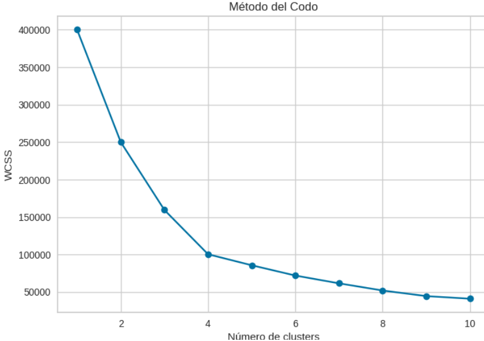
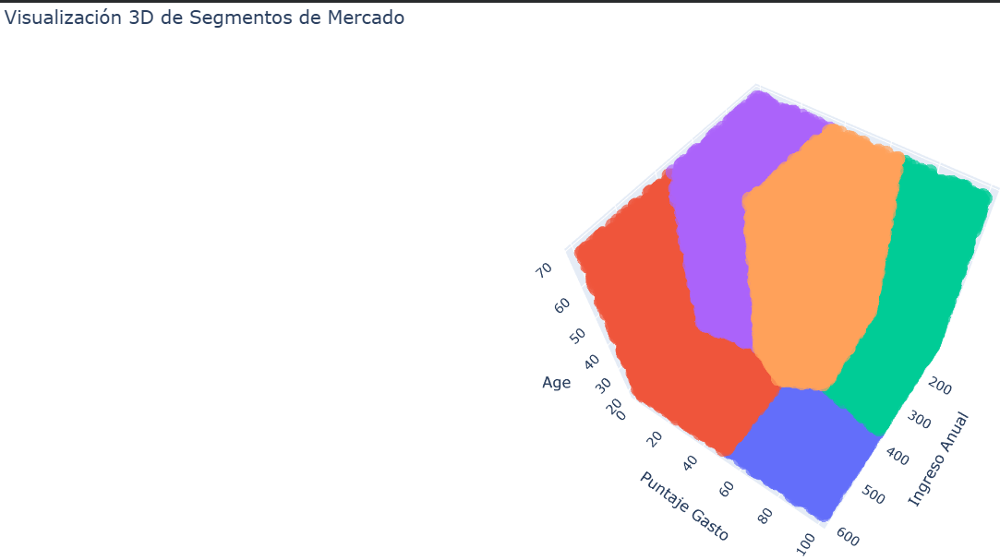
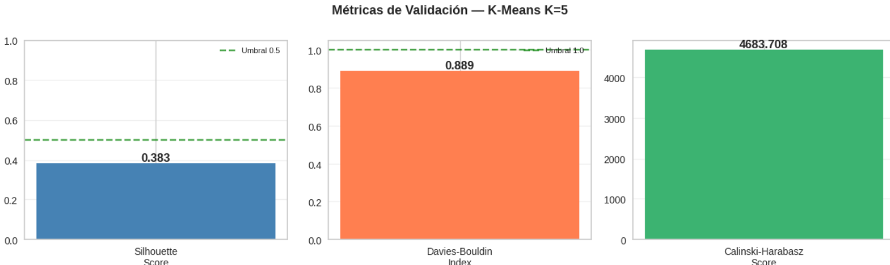

# Segmentación de Clientes con K-Means Clustering

## Descripción del Proyecto
Este proyecto implementa un modelo de Machine Learning no supervisado (K-Means Clustering) para segmentar a los clientes de un centro comercial en grupos con características similares de comportamiento de compra.

## Propósito
Ayudar al área de marketing a identificar grupos de clientes para diseñar estrategias personalizadas como promociones, descuentos y campañas dirigidas a cada perfil, optimizando los recursos de la empresa.

## Contexto Empresarial
Un centro comercial con más de 200,000 registros de clientes necesita optimizar sus recursos de marketing. En lugar de enviar la misma oferta a todos, este modelo identifica distintos tipos de clientes con comportamientos diferentes, permitiendo tomar decisiones basadas en datos y mejorar la competitividad del negocio.

## Funcionalidades del Proyecto
1. Carga y limpieza de la base de datos
2. Aplicación del algoritmo K-Means
3. Determinación del número óptimo de clusters mediante el método del codo
4. Visualización de los segmentos
5. Generación de perfiles de cliente
6. Búsqueda de clientes por ID

## Estructura del Proyecto
Segmentacion-de-Mercado-Abrajan/
│
├── data/
│ └── mall_customers_200k.csv
│
├── images/
│ ├── elbow_method.png
│ ├── clusters.png
│
├── Segmentación.ipynb
├── requirements.txt
└── README.md

## Requisitos
- Python 3.8 o superior
- Jupyter Notebook o Google Colab
- El archivo requirements.txt contiene todas las dependencias necesarias para ejecutar el proyecto.

## Instalación
Instalar dependencias con:
pip install pandas numpy matplotlib seaborn scikit-learn o 
O usando requirements.txt: pip install -r requirements.txt

## Uso
1. Clonar el repositorio: git clone https://github.com/tu-usuario/segmentacion-abrajan.git
2. Entrar al directorio: cd segmentacion-abrajan
3. Ejecutar Jupyter Notebook: jupyter notebook
4. Abrir el archivo Segmentación.ipynb  
5. Ejecutar las celdas en orden  

## Parámetros Modificables
- n_clusters: define cuántos grupos se generan. Un valor incorrecto puede generar segmentos poco útiles o sobreajuste.
- Variables seleccionadas: determinan el criterio de segmentación. Cambiar variables cambia completamente los resultados.
- Escalado: evita que variables con mayor magnitud dominen el modelo.
- PCA: reduce dimensiones y facilita visualización, pero puede perder información.

Ejemplo: kmeans = KMeans(n_clusters=5, random_state=42)
## Validación del Modelo

El modelo K-Means con K=5 fue validado mediante múltiples métricas estadísticas aplicadas sobre una muestra de 5,000 registros del dataset completo de 200,000 clientes.

## Métricas de validación

| Métrica | Valor | Interpretación |
|---|---|---|
| Silhouette Score | 0.3834 | ⚠️ Moderada — clusters funcionales con traslape natural |
| Davies-Bouldin Index | 0.8890 | ✅ Excelente — buena separación entre clusters (< 1) |
| Calinski-Harabasz Score | 4683.71 | ✅ Alto — clusters compactos y bien definidos |
| Inercia (WCSS) | 85,622.98 | Referencia del método del codo para K=5 |

> **Conclusión:** El modelo es **funcional y estratégicamente interpretable**. El Davies-Bouldin Excelente confirma que los 5 segmentos están bien separados entre sí. El Silhouette moderado es esperado dado que los datos reales de clientes tienen traslape natural entre perfiles.

## Distribución de segmentos (200,000 clientes)

| Cluster | Perfil | Clientes | % del mercado |
|---|---|---|---|
| C0 | 🔴 VIP — Alto Ingreso / Alto Gasto | 47,376 | 23.7% |
| C1 | 🔵 Conservadores — Bajo Ingreso / Bajo Gasto | 34,572 | 17.3% |
| C2 | 🟢 Moderados — Ingreso Medio / Gasto Medio | 36,063 | 18.0% |
| C3 | 🟠 Potenciales — Alto Ingreso / Bajo Gasto | 47,745 | 23.9% |
| C4 | 🟣 Impulsivos — Bajo Ingreso / Alto Gasto | 34,244 | 17.1% |

### Criterios de validación aplicados

1. **Métricas estadísticas** — Silhouette, Davies-Bouldin y Calinski-Harabasz confirman cohesión interna y separación entre grupos.
2. **Selección de K** — Se compararon valores de K=2 a K=10; K=5 es el punto de equilibrio entre precisión técnica y utilidad estratégica.
3. **Análisis de centroides** — Los 5 centroides ocupan posiciones claramente diferenciadas en el espacio ingreso-gasto.
4. **Interpretabilidad estratégica** — Cada cluster tiene un perfil comercial accionable directamente por el área de marketing.

## Ejemplos de Uso

Aplicación de K-Means: Este código entrena el modelo K-Means con 5 clusters: Este código entrena el modelo K-Means y asigna un cluster a cada cliente.
from sklearn.cluster import KMeans

## Ejemplos de Uso

### Ejemplo 1 — Entrenamiento del modelo K-Means

Entrena el modelo con 5 clusters sobre las variables `Annual_Income` y `Spending_Score`.
El parámetro `random_state=42` garantiza resultados reproducibles.

```python
from sklearn.cluster import KMeans

X = df[['Annual_Income', 'Spending_Score']]

kmeans = KMeans(n_clusters=5, random_state=42)
kmeans.fit(X)
labels = kmeans.labels_

print(f"Clusters asignados: {set(labels)}")
# Output: Clusters asignados: {0, 1, 2, 3, 4}
```

---

### Ejemplo 2 — Método del codo para seleccionar K óptimo

Evalúa la inercia para valores de K entre 1 y 10.
El punto donde la curva "dobla" indica el número óptimo de clusters.

```python
import matplotlib.pyplot as plt

inertia = []
for k in range(1, 11):
    kmeans = KMeans(n_clusters=k, random_state=42)
    kmeans.fit(X)
    inertia.append(kmeans.inertia_)

plt.plot(range(1, 11), inertia, marker='o')
plt.title('Método del Codo')
plt.xlabel('Número de Clusters (K)')
plt.ylabel('Inercia (WCSS)')
plt.show()
# Output: Gráfica que muestra K=5 como punto de quiebre óptimo
```

---

### Ejemplo 3 — Visualización de segmentos con PCA

Reduce las dimensiones a 2 componentes para graficar los clusters.
Cada color representa un segmento distinto de clientes.

```python
from sklearn.decomposition import PCA

pca = PCA(n_components=2)
X_pca = pca.fit_transform(X)

plt.figure(figsize=(10, 6))
plt.scatter(X_pca[:, 0], X_pca[:, 1], c=labels, cmap='viridis', alpha=0.5)
plt.title('Segmentación de Clientes — K-Means (K=5)')
plt.xlabel('Componente Principal 1')
plt.ylabel('Componente Principal 2')
plt.colorbar(label='Cluster')
plt.show()
# Output: Gráfica con 5 grupos de colores diferenciados
```
### Resultados

## Método del codo
El método del codo permitió identificar el número óptimo de clusters para el modelo. Se observa un punto donde la disminución de la inercia comienza a estabilizarse, indicando que agregar más clusters no aporta mejoras significativas. En este caso, se seleccionó un valor adecuado de clusters para lograr una segmentación eficiente sin sobreajuste.

## Segmentación de clientes
La gráfica de clusters muestra la distribución de los clientes en distintos grupos, donde cada color representa un segmento diferente. Esto permite visualizar cómo se agrupan los clientes según sus características.

Segmentación por Spendig Core:

Métricas de Validación:


## Análisis de segmentos

A partir del modelo de K-Means, se identificaron distintos perfiles de clientes:

- **Cluster 1:** Clientes con alto ingreso y alto nivel de consumo. Representan un segmento estratégico para programas de fidelización.
- **Cluster 2:** Clientes con ingreso medio y consumo frecuente. Son ideales para promociones regulares.
- **Cluster 3:** Clientes con bajo ingreso y bajo consumo. Representan un segmento sensible al precio.
- **Cluster 4:** Clientes con alto ingreso pero bajo consumo. Oportunidad para incentivar compras.
- **Cluster 5:** Clientes con comportamiento intermedio. Segmento mixto con potencial de crecimiento.

---

### Datos procesados
Se realizó una limpieza y transformación de los datos para asegurar la calidad del análisis, incluyendo selección de variables relevantes y normalización.

Este código asigna a cada cliente un cluster específico que se utiliza para su análisis posterior.

### Conclusión
El modelo de segmentación permite identificar patrones de comportamiento en los clientes, facilitando la toma de decisiones estratégicas basadas en datos. La correcta selección de variables y parámetros es fundamental para obtener resultados útiles en un contexto empresarial real. El uso de técnicas de segmentación como K-Means permite transformar datos en información estratégica para la toma de decisiones empresariales. La correcta selección de variables y parámetros influye directamente en la calidad de los resultados obtenidos.

## Interpretación de Resultados
El modelo identifica diferentes perfiles de clientes, como clientes de alto valor, frecuentes, ocasionales y de bajo consumo.

## Tecnologías Utilizadas

- Python
- Pandas
- NumPy
- Matplotlib
- Seaborn
- Scikit-learn

## Conclusión

El modelo de segmentación permite identificar patrones de comportamiento en los clientes, facilitando la toma de decisiones estratégicas basadas en datos. La correcta selección de variables y parámetros es clave para obtener resultados útiles en un contexto empresarial.
